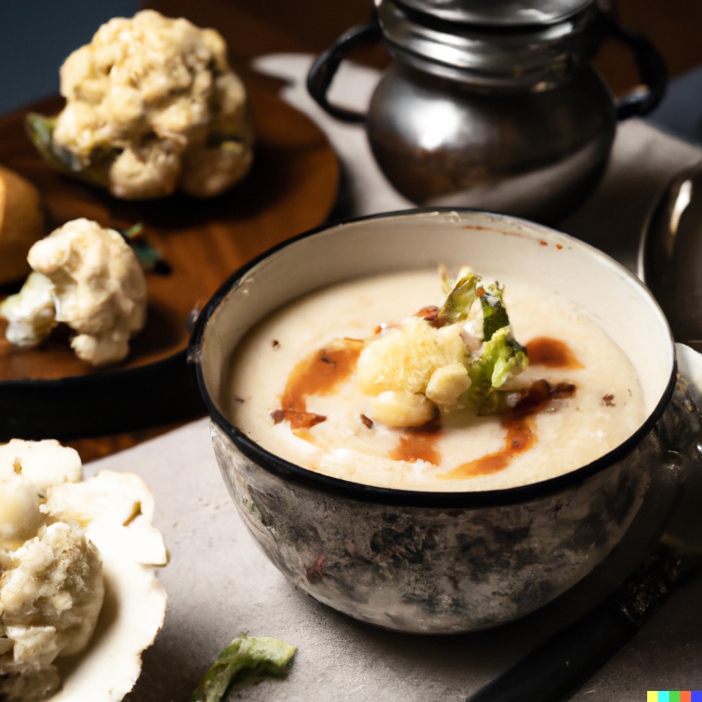

## Ingredients:

* 40g unsalted butter
* 1 onion, roughly chopped
* 1 medium cauliflower, broken into florets and chopped (reserve the stem and leaves if you like)
* 1 medium Maris Piper or King Edward potato, cut into chunks
* 1 litre vegetable stock
* 500ml whole milk
* 150ml double cream or crème fraîche
* small handful of thyme leaves or snipped chives, to serve
* drizzle of extra virgin olive oil, to serve (optional)

## \
Method

* Melt the butter in a large saucepan over a medium heat until sizzling, then cook the onions for a few minutes. Stir in the cauliflower and potatoes (if you like, finely chop the cauliflower stem and add this too) to coat in the buttery onions, then cover and cook over a low heat for about 10 mins, stirring once or twice until the veg is softened but not coloured.
* Pour in the stock and bring to the boil, then add the milk and gently return to the boil. Add the cauliflower leaves, if using, season to taste, then simmer uncovered for 12-15 mins until the vegetables are very soft.
* Stir in the cream and return to the boil. Remove from the heat and blitz using a hand blender until smooth. For an extra-silky finish, you can push the purée through a sieve, but this is not essential. *The soup can now be cooled, covered and chilled for up to three days, or portioned and frozen for up to three months. Reheat until piping hot*. Serve ladled into bowls and scattered with thyme leaves or chives and freshly ground black pepper, and drizzled with olive oil, if you like.