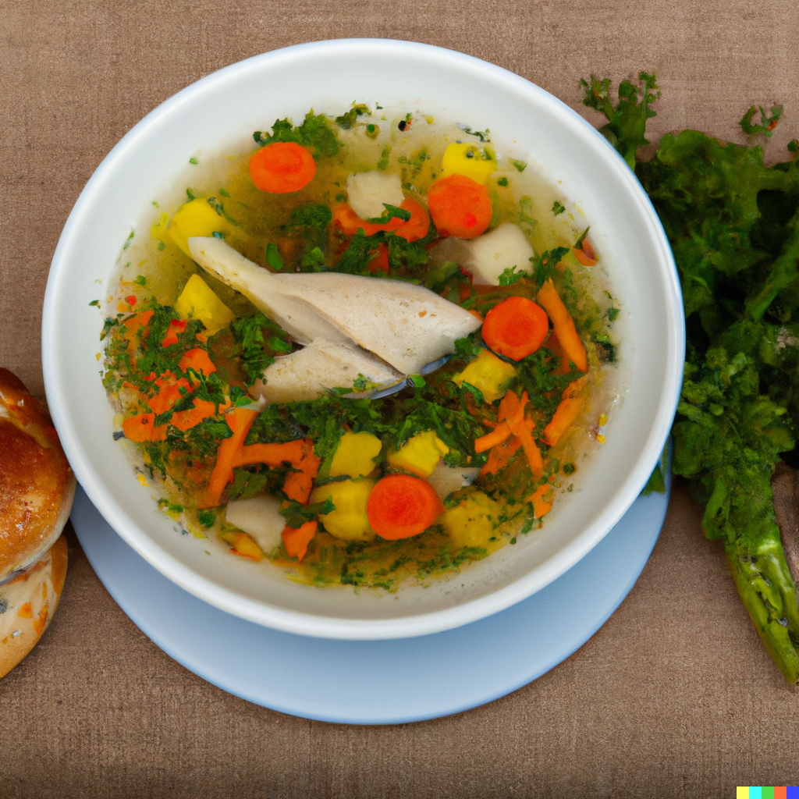

## Ingredients:

* 1.6-1.8kg kosher chicken
* 2 medium [onions](https://www.bbcgoodfood.com/glossary/onion-glossary)
* 3 [celery sticks,](https://www.bbcgoodfood.com/glossary/celery-glossary) halved
* 3 large [carrots,](https://www.bbcgoodfood.com/glossary/carrots-glossary) scrubbed and halved
* 1 [parsnip,](https://www.bbcgoodfood.com/glossary/parsnip-glossary) scrubbed and halved
* 1 medium-sized, ripe tomato
* 3 [cherry tomatoes](https://www.bbcgoodfood.com/glossary/tomato-glossary)
* 1 fennel bulb, scrubbed and halved through the root
* a handful [flat-leaf parsley,](https://www.bbcgoodfood.com/glossary/parsley-glossary) chopped, the stalks reserved for the soup and the leaves to serve
* 20g dill, stalks and leafy fronds separated, stalks roughly chopped and leafy fronds finely chopped
* 10 black peppercorns
* 1 bay leaf
*

## For the matzo balls

* 4 [eggs](https://www.bbcgoodfood.com/glossary/egg-glossary)
* 2 tbsp chicken schmaltz (see step 3) or use vegetable oil
* 120g medium matzo meal (see tip, below)
* leafy fronds of dill (from the soup ingredients above), chopped
* 2 tbsp [horseradish sauce](https://www.bbcgoodfood.com/glossary/horseradish-glossary)
*

## To serve

* 3 medium [carrots,](https://www.bbcgoodfood.com/glossary/carrots-glossary) peeled (optional)

## Method

* The day before you want to serve the soup, put the whole chicken in your largest lidded pan. Add sufficient cold water to cover by at least 1cm. Bring the water to a boil over a high heat, skimming off (and discarding) any foam with a big metal spoon. While it’s boiling, halve the onions through the roots (leaving the skins on – they will add colour). As soon as it starts to boil, add the onions and remaining soup ingredients plus 1 tbsp salt. Turn down the heat to a very low simmer, partially cover the pan and leave to cook gently for 1 hr 30 mins, until you see the meat on the chicken’s legs start to come away from the bone. Depending on how large your pan is you may need to drain a little water off to fit the vegetables in, so it doesn’t overflow.
* Use two forks to carefully remove the chicken from the pot, leaving the veg behind. Strip the meat from the bones, tearing some of the chicken into pieces to serve in the soup (save the rest to use in salads, sandwiches or pies). Return the bones and cartilage to the pot and simmer gently for a further 1 hr-1 hr 30 mins. Strain the soup into a large container or pan. If they are still in reasonable shape, lightly scrape the peel from the carrots and slice them to go in the finished soup – keep refrigerated until needed. Discard the other vegetables and the bones. Leave the soup to cool completely then refrigerate overnight.
* By morning, the fat will have risen to the surface – skim it off, pop it in a dish and refrigerate it. This is known as schmaltz, which you'll need to make the matzo balls. (You can use what’s left over to make roast potatoes.) Taste the soup to see if it has enough flavour. It may need to be reduced a little by boiling it rapidly, then seasoning.
* To make the matzo balls, use a fork to beat the eggs with ½ tsp salt and a few grinds of pepper. Stir in the schmaltz, matzo meal, 2 tbsp chopped dill, horseradish and 60ml chicken soup. Fold into the egg mixture (it will be quite sloppy). Cover and refrigerate for at least 30 mins to hydrate the matzo meal and firm the mixture enough to handle. Scoop heaped tablespoons of the mixture and, with moistened hands, gently roll into balls. Put them on a plate or on a tray lined with baking parchment. You should end up with 12 matzo balls.
* Fill a wide [pan](https://www.bbcgoodfood.com/review/five-best-saucepans) with cold water and season with 1 tbsp salt. Set it over a high heat to boil, then transfer the matzo balls, one by one, gently into the water. Turn the heat down to a simmer. Cover with a lid (preferably a glass one) and leave for 30 mins. Do not be tempted to peek too soon. They are done when they have puffed up and when you cut into one, it should be light all the way through to the centre.
* If including fresh carrots in the soup, slice them into 2cm-thick discs and add them to the soup pot with the chicken pieces. Simmer for 10-15 mins to soften the carrot and heat the chicken. If using the carrot from the stock, add for the last 3 mins to heat up. When the matzo balls are ready, carefully remove them from the pot using a slotted spoon and put two (or three) in each bowl. Ladle over the hot chicken soup. Sprinkle with more chopped dill to serve.