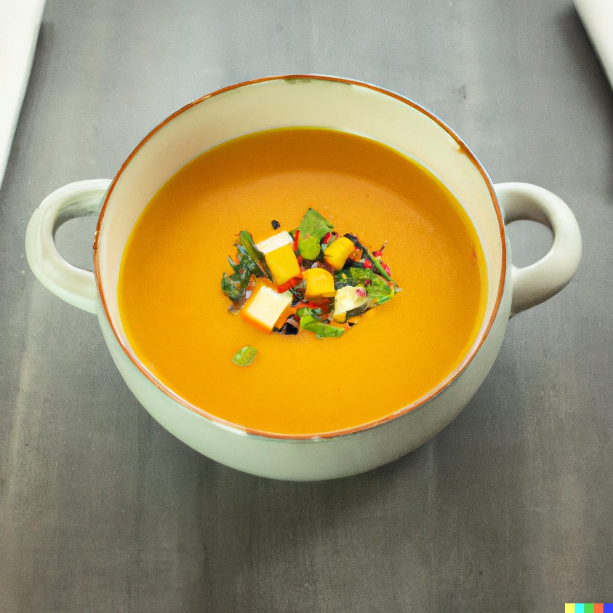

## Ingredients:

* 2 tsp rapeseed oil
* 1 large onion, chopped
* 400g butternut squash, skin-on, cut into chunks
* 2 garlic cloves, chopped
* 210g can butter beans, drained
* 2 tsp vegetable bouillon
* 80g shredded kale, finely chopped
* 2 tsp sesame oil
* 2 tsp toasted sesame seeds
* 2 tsp finely grated ginger
* 1 tbsp brown rice miso

## Method

* Heat the oil in a large pan and fry the onion for 5 mins to soften. Add the squash and garlic, and stir for a minute. Add the beans and bouillon along with a litre of water, then cover and simmer for 20 mins until the squash is tender.
* Meanwhile, steam the kale for 10 mins, then toss together with the sesame oil, seeds and ginger.
* Add the miso to the soup, then blitz until smooth using a hand blender. Pour into bowls and top with the sesame kale mix to serve.