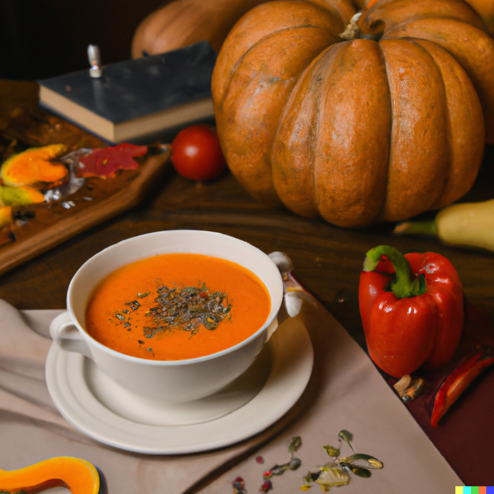

## Ingredients:

* 2 tbsp olive oil
* 2 onions, finely chopped
* 1kg pumpkin or squash (try kabocha), peeled, deseeded and chopped into chunks
* 700ml vegetable stock or chicken stock
* 150ml double cream

## For the croutons

* 2 tbsp olive oil
* 4 slices wholemeal seeded bread, crusts removed
* handful pumpkin seeds

## Method

* Heat 2 tbsp olive oil in a large saucepan, then gently cook 2 finely chopped onions for 5 mins, until soft but not coloured.
* Add 1kg pumpkin or squash, cut into chunks, to the pan, then carry on cooking for 8-10 mins, stirring occasionally until it starts to soften and turn golden.
* Pour 700ml vegetable or chicken stock into the pan and season with salt and pepper. Bring to the boil, then simmer for 10 mins until the squash is very soft.
* Pour 150ml double cream into the pan, bring back to the boil, then purée with a hand blender. For an extra-velvety consistency you can pour the soup through a fine sieve. *The soup can now be frozen for up to 2 months.*
* To make the croutons: cut 4 slices wholemeal seeded bread into small squares.
* Heat 2 tbsp olive oil in a frying pan, then fry the bread until it starts to become crisp.
* Add a handful of pumpkin seeds to the pan, then cook for a few mins more until they are toasted. *These can be made a day ahead and stored in an airtight container.*
* Reheat the soup if needed, taste for seasoning, then serve scattered with croutons and seeds and drizzled with more olive oil, if you want.