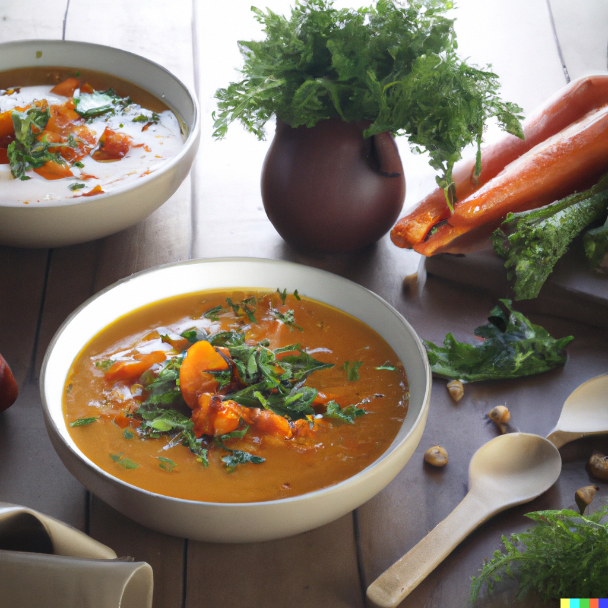

## Ingredients:

* 2 tsp cumin seeds
* pinch chilli flakes
* 2 tbsp olive oil
* 600g carrots, washed and coarsely grated (no need to peel)
* 140g split red lentils
* 1l hot vegetable stock (from a cube is fine)
* 125ml milk (to make it dairy-free, see 'try' below)
* plain yogurt and naan bread, to serve

## Method

* Heat a large saucepan and dry-fry 2 tsp cumin seeds and a pinch of chilli flakes for 1 min, or until they start to jump around the pan and release their aromas.
* Scoop out about half with a spoon and set aside. Add 2 tbsp olive oil, 600g coarsely grated carrots, 140g split red lentils, 1l hot vegetable stock and 125ml milk to the pan and bring to the boil.
* Simmer for 15 mins until the lentils have swollen and softened.
* Whizz the soup with a stick blender or in a food processor until smooth (or leave it chunky if you prefer).
* Season to taste and finish with a dollop of plain yogurt and a sprinkling of the reserved toasted spices. Serve with warmed naan breads.